# Incidentes-Viales-Ciudad-de-Mexico-2014-a-2024-Python

**Lenguaje: Python 3.x**

**Librerías: Pandas, Matplotlib, Seaborn, NumPy**

**Entorno: Google Colab / Jupyter Notebook**

## Este proyecto analiza los registros oficiales de incidentes viales (choques, atropellamientos, volcaduras, entre otros) en la Ciudad de México. El objetivo es identificar los factores que contribuyen a la siniestralidad vial, analizando variables temporales y geográficas para proponer una visión basada en datos sobre la seguridad en las vías de la ciudad.

**Mapa de calor de incidentes viales**
**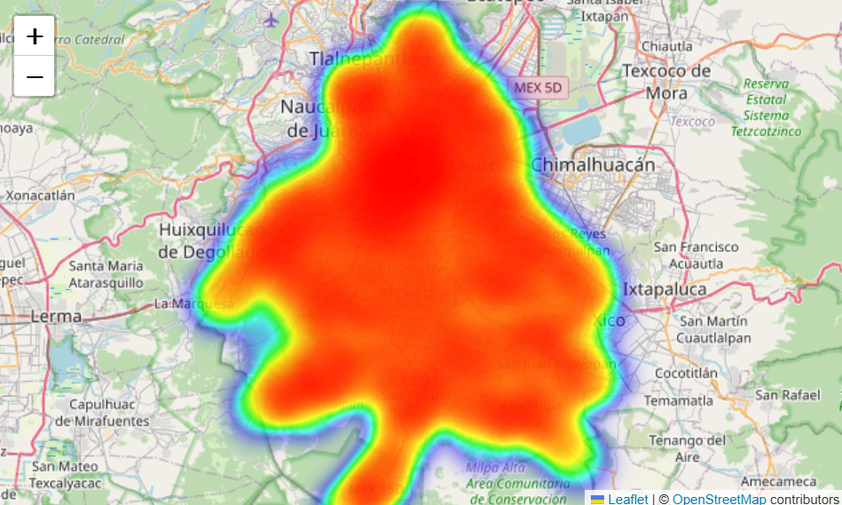**
**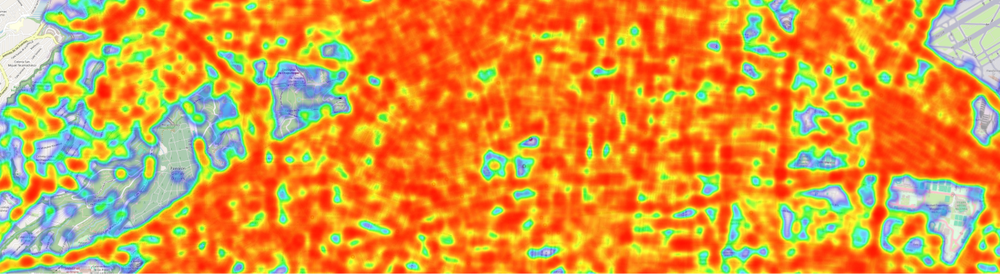**
**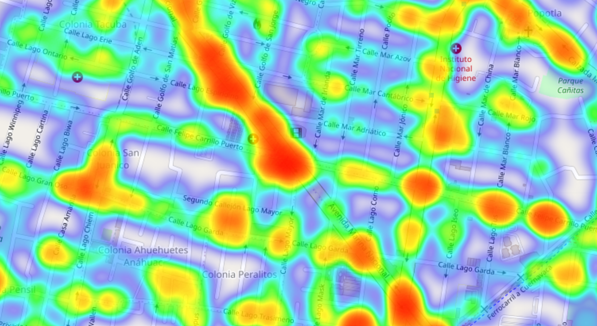**

**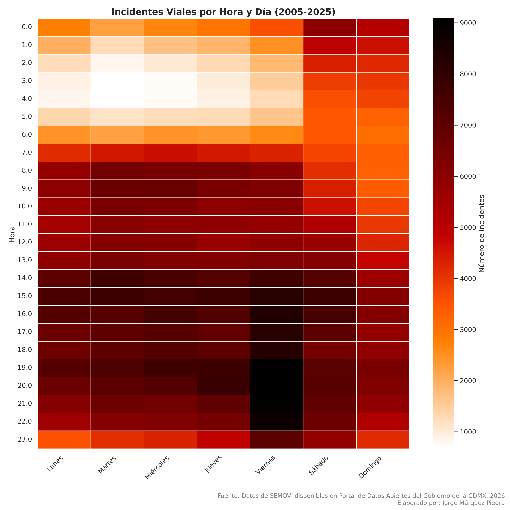**

**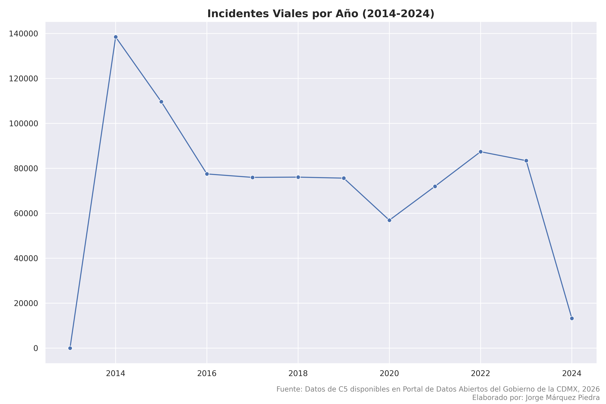**

**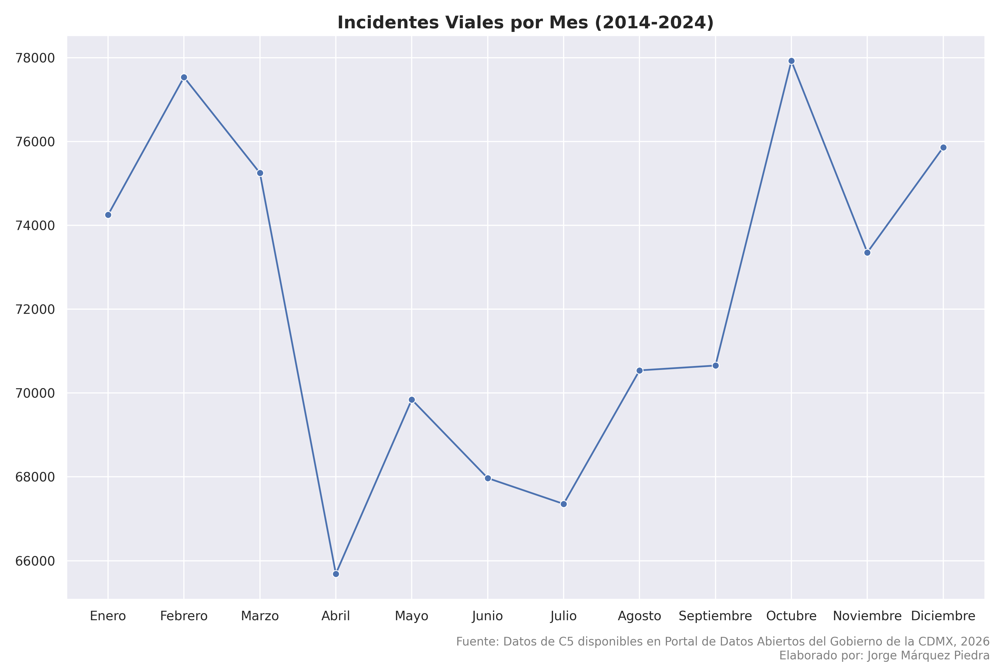**

**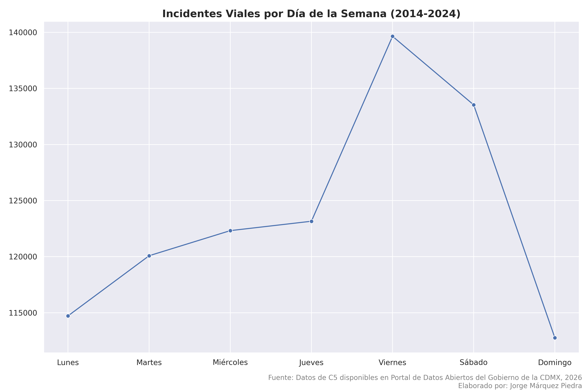**

**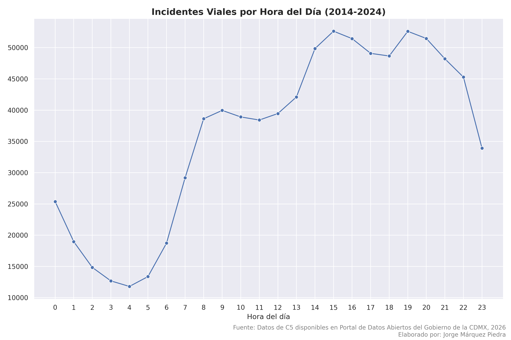**

**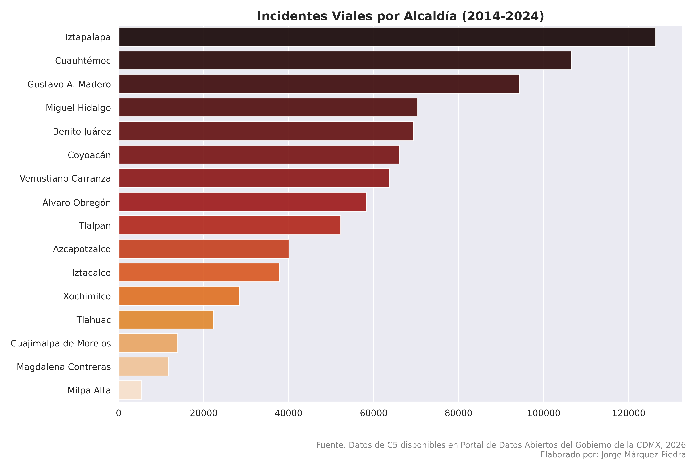**

**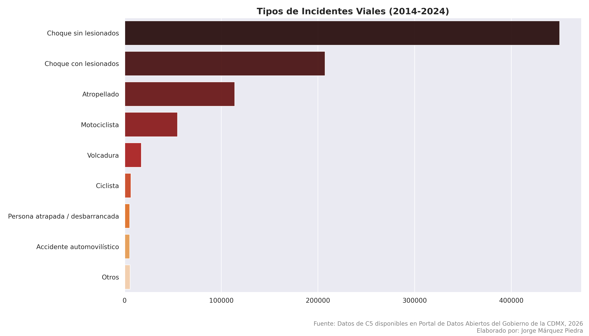**

**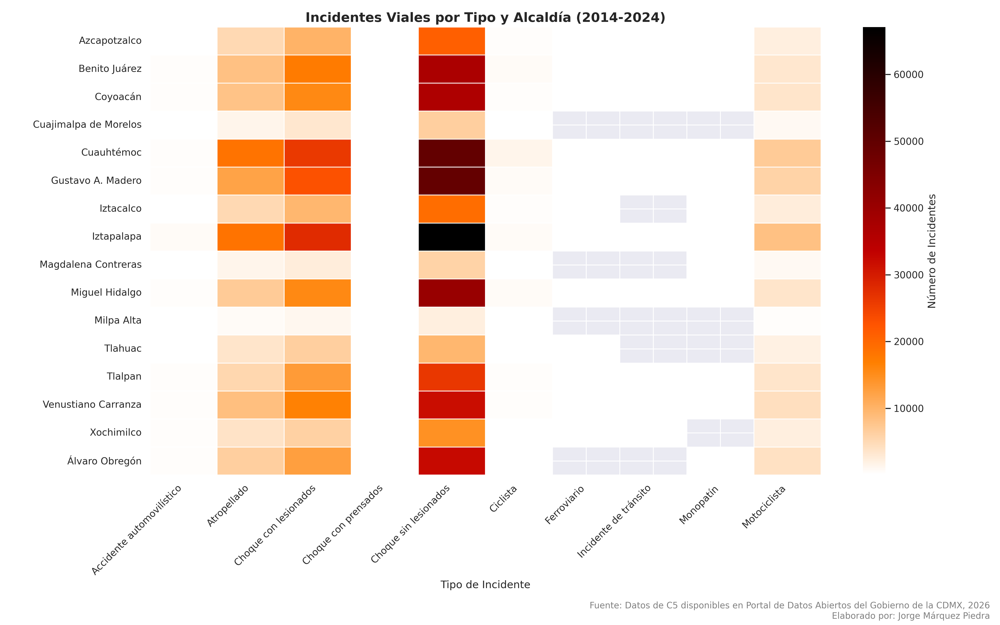**

## Los datos fueron obtenidos del [Portal de Datos Abiertos de la Ciudad de México](https://datos.cdmx.gob.mx/).
